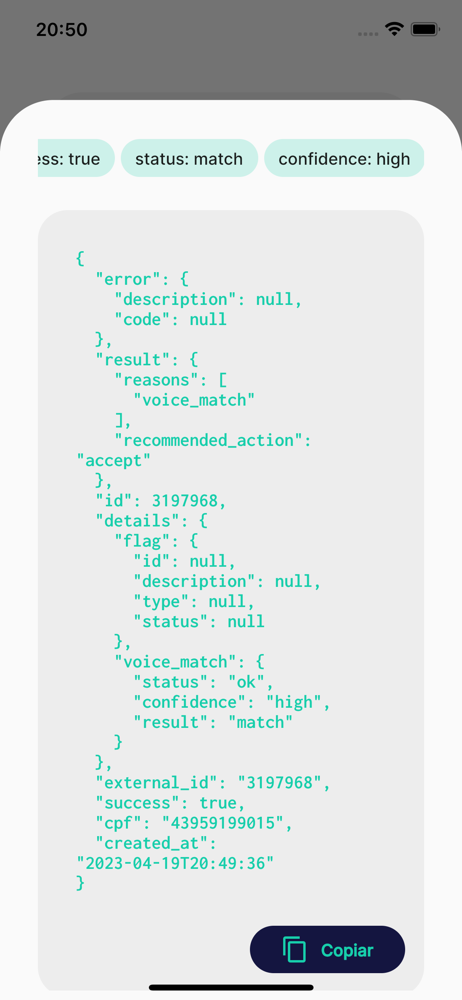

# Minds Mobile SDK Flutter Demo

Esta é uma documentação para a integração da SDK da Minds Digital em um projeto Flutter.

A integração com a SDK de Biometria de Voz é feita através da criação de Method Channels para cada plataforma, conforme exemplificado abaixo:

Exemplo de integração [SDK Android](/android)

Exemplo de integração [SDK iOS](/ios)

   

